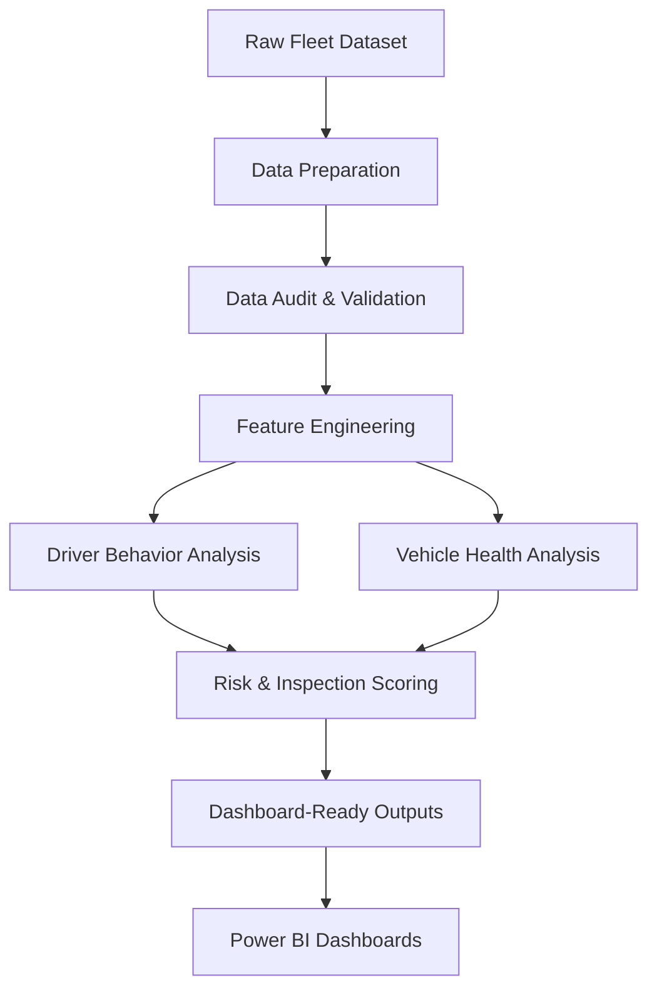

# VexarDrive Fleet Analysis

A data-driven fleet intelligence project that analyzes **driver behavior** and **vehicle health** using fleet telemetry data.

The project combines Python-based data preparation, validation, feature engineering, risk scoring, and interactive Power BI dashboards to identify drivers and vehicles requiring operational attention.

---

## Project Purpose & Objectives

The primary goal is to turn raw fleet telemetry into actionable intelligence supporting:
- Driver behavior monitoring and targeted safety reviews
- Vehicle inspection prioritization and sensor anomaly investigation
- Fleet-level risk assessment

### Key Operational Questions

1. **Driver Behavior:** Which drivers exhibit higher-risk driving patterns?
2. **Vehicle Health:** Which vehicles display abnormal sensor readings and should be prioritized for inspection?

---

## Workflow Pipeline

---

## Core Analytics

### Driver Behavior
Driver-level telemetry is aggregated into risk indicators covering three primary categories:
- **Speed**
- **Acceleration**
- **Maneuvering behavior**

These indicators are combined into a composite **Driver Risk Score** used to rank drivers and surface behavioral patterns needing intervention. Sensitivity analysis is also included to assess how driver rankings change when individual risk components are reweighted or removed.

### Vehicle Health
Vehicle telemetry is evaluated for sensor anomalies across key telemetry metrics:
- **P95 Horizontal Acceleration**
- **P95 Gyroscope Activity**
- **High Gyroscope-Rate Activity**

These metrics are converted into component scores and synthesized into a **Vehicle Inspection Score** to prioritize vehicles for further physical investigation.

> [!NOTE]
> The inspection score reflects **maintenance and inspection priority**, not confirmed mechanical failure.

---

## Tools & Technologies

- **Python** (Pandas, NumPy)
- **Jupyter Notebooks**
- **Parquet** data format
- **Power BI** Desktop

---

## Project Outputs

### Analytical Data Outputs (`data/outputs/`)
- [`driver_dashboard.csv`](file:///c:/Users/User/projects/vexardrive/data/outputs/driver_dashboard.csv) — Aggregated driver metrics, risk scores, and rankings.
- [`vehicle_dashboard.csv`](file:///c:/Users/User/projects/vexardrive/data/outputs/vehicle_dashboard.csv) — Vehicle sensor indicators and inspection priority scores.

### Power BI Reports (`outputs/`)
- [`driver_behavior.pbix`](file:///c:/Users/User/projects/vexardrive/outputs/driver_behavior.pbix) — Interactive driver risk profiles and ranking dashboard.
- [`vehicle_health_status.pbix`](file:///c:/Users/User/projects/vexardrive/outputs/vehicle_health_status.pbix) — Interactive vehicle health status and inspection priority dashboard.

*Note: Open `.pbix` files using Power BI Desktop to interact with the dashboards.*

---

## Limitations

- **Analytical Indicators vs. Diagnoses:** Scores represent relative risk and inspection priority within the analyzed fleet, not confirmed mechanical failure or direct driver fault.
- **Sensor Noise:** Measurements may contain sensor noise, device-to-device variations, or installation anomalies.
- **Data Scope:** Findings are grounded strictly in the available observation window and telemetry dataset.
